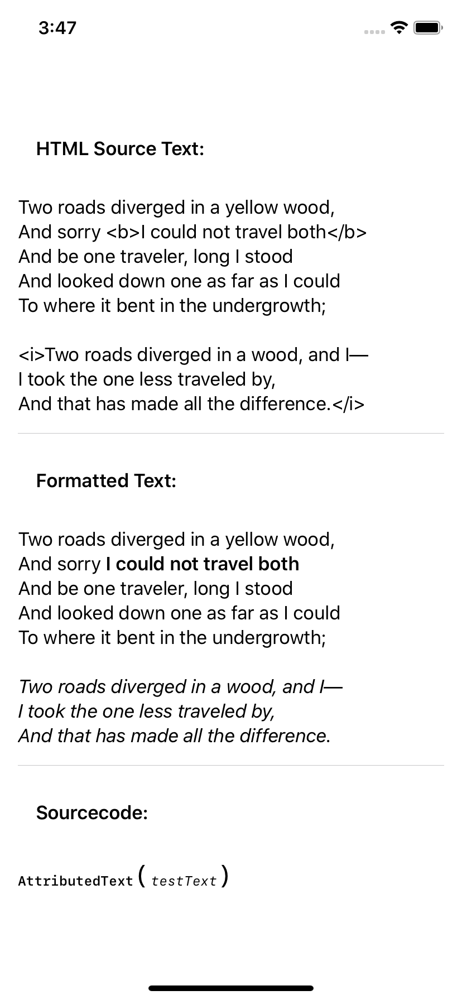

# Attributed HTML Text as native SwiftUI Component


Of course you can use attributed strings and a UILabel and enclose all that in a SwiftUI container ...

... well, I think, if you say yes to SwiftUI, you should always try to go the best and not the easy way.

AttributedText is a component that displays HTML-tagged normal text and displays it formatted. The procedure is easy. The tags are parsed and each chunk is formatted seperately as a Text view. These Text views are glued together by ... yep: the + operator. So an AttributedText view is nothing but a number of standard Text components

## Limitations
As I just needed bold and italic, I just realized these two tags. But it´s very easy to add new tags and their formatting. I just didn´t need them


## Usage: 

The class is in the file **AttributedText.swift**. There are no dependencies

The component is just used as the normal SwiftUI component Text:

```
AttributedText("This is <b>bold</b> and <i>this is italic</i>.")
```

